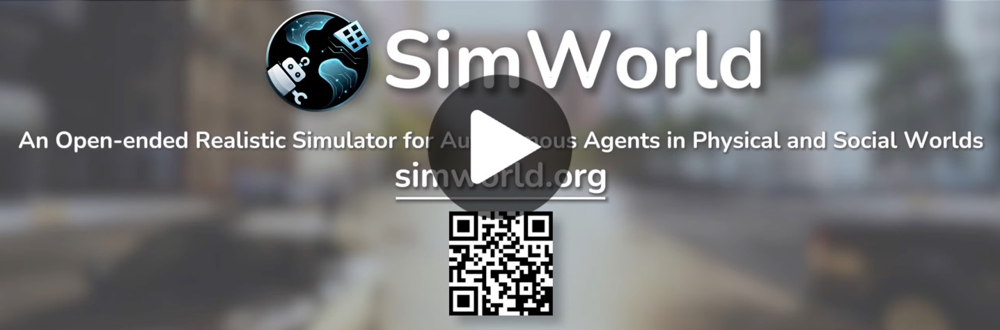

# SimWorld: An Open-ended Realistic Simulator for Autonomous Agents in Physical and Social Worlds
<p align="center">
  
</p>


**SimWorld** is a simulation platform for developing and evaluating **LLM/VLM** AI agents in complex physical and social environments.

In summary, SimWorld supports three levels of usage:
- **[Base](#base-package)**: use the Base package (two lightweight city scenes + one empty map) for core agent interaction and quick testing.
- **[Additional Environments](#additional-environments)**: optionally expand Base with 100+ pre-built maps for richer scenarios.
- **[Customization](#make-your-simworld)**: bring your own UE environments, assets, and agent models to SimWorld for fully customized simulations.

See [Setup](#setup) and [Make Your SimWorld](#make-your-simworld) for details.

<div align="center">
    <a href="https://simworld-ai.github.io/"></a>
    <a href="https://github.com/maitrix-org/SimWorld"></a>
    <a href="https://simworld.readthedocs.io/en/latest"></a>
    <a href="https://arxiv.org/abs/2512.01078"></a>
</div>

## 📌 Table of Contents
- [🎬 Demonstration](#demonstration)
- [🔥 News](#news)
- [💡 Introduction](#introduction)
- [🏗️ Architecture](#architecture)
- [🚀 Quick Tour](#quick-tour) — minimal LLM-driven navigation example
- [⚙️ Setup](#setup) — Python install + UE server download
- [🚀 Quick Start](#quick-start) — run a minimal example
- [📚 Configuration and API Reference](#configuration-and-api-reference) — configs + commonly used APIs
- [🛠️ Make Your SimWorld](#make-your-simworld) — bring your own env/assets/agents
- [🔮 Next Steps](#next-steps)
- [🤝 Contributing](#contributing)
- [⭐ Star History](#star-history)


<a id="demonstration"></a>
## 🎬 Demonstration
<!-- <p align="center">
  <a href="https://youtu.be/-e19MzwDhy4" target="_blank" rel="noopener noreferrer">
    
  </a>
</p> -->
<p align="center">
  <a href="https://www.youtube.com/watch?v=SfOifXTupgY" target="_blank" rel="noopener noreferrer">
    
  </a>
</p>

<p align="center">
  <a href="https://www.youtube.com/@SimWorld-AI" target="_blank" rel="noopener noreferrer">
    ▶ See all our demo videos on YouTube
  </a>
</p>

<a id="news"></a>
## 🔥 News
 - 2026.1 **SimWorld** now supports importing customized environments and agents([doc](https://simworld.readthedocs.io/en/latest/customization/make_your_own_pak.html))!
 - 2025.11 The [white paper](https://simworld.org/assets/white_paper.pdf) of **SimWorld** is available on arxiv!
 - 2025.9 **SimWorld** has been accepted to NeurIPS 2025 main track as a **spotlight** [paper](https://neurips.cc/virtual/2025/loc/san-diego/poster/119002)! 🎉
 - 2025.6 The first formal [release](https://x.com/Lianhuiq/status/1995585268121002381?s=20) of **SimWorld** has been published! 🚀
 - 2025.3 Our [demo](https://www.youtube.com/@SimWorld-AI) of **SimWorld** has been accepted by CVPR 2025 Demonstration Track! 🎉

<a id="introduction"></a>
## 💡 Introduction
SimWorld is built on Unreal Engine 5 and offers core capabilities to meet the needs of modern agent development. It provides:
- Realistic, open-ended world simulation with accurate physics and language-based procedural generation.
- Rich interface for LLM/VLM agents, supporting multi-modal perception and natural language actions.
- Diverse and customizable physical and social reasoning scenarios, enabling systematic training and evaluation of complex agent behaviors like navigation, planning, and strategic cooperation.

<a id="architecture"></a>
## 🏗️ Architecture
<p align="center">
    
</p>

**SimWorld** consists of three layers:
- the Unreal Engine Backend, providing diverse and open-ended environments, rich assets and realistic physics simulation;
- the Environment layer, supporting procedural city generation, language-driven scene editing, gym-like APIs for LLM/VLM agents and traffic simulation;
- the Agent layer, enabling LLM/VLM agents to reason over multimodal observations and history while executing actions via a local action planner.

SimWorld's architecture is designed to be modular and flexible, supporting an array of functionalities such as dynamic world generation, agent control, and performance benchmarking. The components are seamlessly integrated to provide a robust platform for **Embodied AI** and **Agents** research and applications.

### Project Structure
```bash
simworld/               # Python package
    local_planner/      # Local action planner component
    agent/              # Agent system
    assets_rp/          # Live editor component for retrieval and re-placing
    citygen/            # City layout procedural generator
    communicator/       # Core component to connect Unreal Engine
    config/             # Configuration loader and default config file
    llm/                # Basic llm class
    map/                # Basic map class and waypoint system
    traffic/            # Traffic system
    utils/              # Utility functions
    data/               # Default data files, e.g., object categories
    weather/            # Weather system
data/                   # Necessary input data
config/                 # Example configuration file and user configuration file
examples/                # Examples of usage, such as layout generation and traffic simulation
docs/                   # Documentation source files
README.md
```

<a id="quick-tour"></a>
## 🚀 Quick Tour
Here's a minimal example showing how to create an LLM-driven navigation task in SimWorld. This demo creates a humanoid agent that autonomously navigates to a target location using natural language reasoning and a Gym-like interface.

For the complete implementation, see [examples/gym_interface_demo.ipynb](examples/gym_interface_demo.ipynb). More examples are available in the [examples/](examples/) directory.

```python
import math
from simworld.communicator.communicator import Communicator
from simworld.communicator.unrealcv import UnrealCV
from simworld.llm.base_llm import BaseLLM
from simworld.agent.humanoid import Humanoid
from simworld.utils.vector import Vector

# 1. Define Agent class - uses LLM to decide navigation actions
class Agent():
    def __init__(self):
        self.llm = BaseLLM("gpt-4o")
        self.system_prompt = """ ... Your task is to ..."""

    def action(self, obs, target):
        position = obs['position']
        direction = obs['direction']

        # Calculate angle to target
        current_yaw = math.degrees(math.atan2(direction.y, direction.x))
        # ... calculate angle difference to target ...

        prompt = f""" ... Choose your next action ..."""

        action, _ = self.llm.generate_text(system_prompt=self.system_prompt, user_prompt=prompt)
        return action.strip()

# 2. Define Environment class - Gym-like interface
class Environment:
    def __init__(self, communicator, config=Config()):
        self.communicator = communicator
        self.agent = None
        self.target = None
        # ... initialize map and config ...

    def reset(self):
        """Spawn/reset humanoid and return initial observation."""
        spawn_location = Vector(0, 0)
        spawn_forward = Vector(1, 0)

        # ============ IMPORTANT: Spawn humanoid agent in UE world ============
        self.agent = Humanoid(  # <=========== Create humanoid agent
            communicator=self.communicator,
            position=spawn_location,
            direction=spawn_forward,
            config=self.config,
            map=self.map
        )
        self.communicator.spawn_agent(self.agent, name=None, model_path=agent_bp, type="humanoid")  # <=========== Spawn in UE
        self.target = Vector(1700, -1700)

        # ============ IMPORTANT: Get initial observation ============
        loc_3d = self.communicator.unrealcv.get_location(self.agent_name)  # <=========== Get agent position
        position = Vector(loc_3d[0], loc_3d[1])

        orientation = self.communicator.unrealcv.get_orientation(self.agent_name)  # <=========== Get agent orientation
        yaw = orientation[1]  # Yaw angle in degrees
        # Convert yaw to direction vector
        direction = Vector(math.cos(math.radians(yaw)), math.sin(math.radians(yaw)))

        ego_view = self.communicator.get_camera_observation(self.agent.camera_id, "lit")  # <=========== Get camera view

        observation = {
            'position': position,
            'direction': direction,  # unit vector
            'ego_view': ego_view     # RGB image
        }
        return observation

    def step(self, action):
        """Parse and execute action, return new observation and reward."""
        # ============ IMPORTANT: Execute humanoid movement commands ============
        if action.startswith("forward"):
            # Extract duration and execute forward movement
            self.communicator.humanoid_step_forward(self.agent.id, duration, direction=0)  # <=========== Move forward
        elif action.startswith("rotate"):
            # Extract angle and direction, execute rotation
            self.communicator.humanoid_rotate(self.agent.id, angle, direction)  # <=========== Rotate left/right
        # ... handle other actions ...

        # Get new observation and calculate reward
        # ... update position, direction, ego_view ...
        reward = -position.distance(self.target)  # negative distance
        return observation, reward, success

# 3. Main loop - observe, decide, execute
communicator = Communicator(UnrealCV())
agent = Agent()
env = Environment(communicator)

obs = env.reset()
print(f"Task: Navigate to target position {env.target}")

for i in range(100):
    # Agent decides next action based on observation
    action = agent.action(obs, env.target)
    print(f"Step {i+1}: Action = '{action}'")

    # Execute action and get new observation
    obs, reward, success = env.step(action)

    if success:
        print(f"  Position: {obs['position']}, Reward: {reward:.2f}")

        # Check if reached target
        if obs['position'].distance(env.target) < 200:
            print("Target reached!")
            break
```

<a id="setup"></a>
## ⚙️ Setup

This section walks through the minimal setup to run SimWorld using our provided UE packages and the Python client. If you want to use your own custom environments, assets, or agent models, you can import them via `.pak` files. See [Make Your SimWorld](#make-your-simworld) for instructions.

**System Requirements:** SimWorld requires Windows or Linux operating system, a dedicated GPU with ≥6GB VRAM, 32GB RAM, and 50-200GB disk space depending on the package. For detailed hardware requirements and recommendations, see the [Device Requirement](https://simworld.readthedocs.io/en/latest/getting_started/installation.html).


### Installation
#### Step 1. Install the Python Client

Make sure to use Python 3.10 or later.
```bash
git clone https://github.com/SimWorld-AI/SimWorld.git
cd SimWorld
conda create -n simworld python=3.10
conda activate simworld
pip install -e .
```

#### Step 2. Download the UE Server Package

First, download and extract the **Base** UE server package for your OS. The Base package includes two lightweight city scenes and one empty map for quickly testing SimWorld’s core features, including core agent interaction and procedural city generation.

<a id="base-package"></a>
- **Base (required, 2 city maps and 1 empty map)**
  - **Windows:** [Download](https://huggingface.co/datasets/SimWorld-AI/SimWorld/blob/main/Base/Windows.zip)
  - **Linux:** [Download](https://huggingface.co/datasets/SimWorld-AI/SimWorld/blob/main/Base/Linux.zip)

If you want more pre-built scenes for demos and diverse scenarios, you can optionally install **Additional Environments (100+ Maps)**. This is an add-on map pack that extends the Base installation. Download the maps you need and copy the `.pak` files into the Base server folder at:
`SimWorld/Content/Paks/`.

<a id="additional-environments"></a>
- **Additional Environments (optional, 100+ maps)**
  - **Windows:** [Download](https://huggingface.co/datasets/SimWorld-AI/SimWorld/tree/main/AdditionEnvironmentPaks/Windows)
  - **Linux:** [Download](https://huggingface.co/datasets/SimWorld-AI/SimWorld/tree/main/AdditionEnvironmentPaks/Linux)

The Additional Environments package is organized as separate `.pak` files, so you can download only the maps you need. Please check the [download and installation](https://simworld.readthedocs.io/en/latest/getting_started/additional_environments.html#download-and-installation) for usage instructions, including how to load specific maps and what each `.pak` contains.


<a id="quick-start"></a>
### Quick Start

We provide several examples of code in [examples/](examples/), showcasing how to use the basic functionalities of SimWorld, including city layout generation, traffic simulation, asset retrieval, and activity-to-actions. Please follow the examples to see how SimWorld works.

#### Start the UE Server
Start the SimWorld UE server first, then run the Python examples. From the extracted UE server package directory:

- **Windows:** double-click `SimWorld.exe`, or launch it from the command line:
  ```bash
  ./SimWorld.exe <MAP_PATH>
  ```

- **Linux:** run:
    ```bash
    ./SimWorld.sh <MAP_PATH>
    ```

`<MAP_PATH>` refers to the Unreal Engine internal path to a map file (e.g., `/Game/hospital/map/demo.umap`). SimWorld's **base** binary contains 2 city maps and 1 empty map. See [Base Environments](https://simworld.readthedocs.io/en/latest/getting_started/base_environments.html) for details. In addition, users can download 100+ **additional environment paks**. See the [Additional Environments](https://simworld.readthedocs.io/en/latest/getting_started/additional_environments.html) for the installation and complete list of available map paths. If `<MAP_PATH>` is not specified, the default map (`/Game/Maps/demo_1`) will be open.

<a id="configuration-and-api-reference"></a>
## 📚 Configuration and API Reference

### Configuration

SimWorld uses a YAML configuration file to control **global simulator settings** (e.g., `seed`, `dt`, UE blueprint paths) and **module behaviors** (e.g., city generation, traffic simulation, asset retrieval, and agent/LLM options).

For a comprehensive reference of all configuration parameters, see the [Configuration Reference](https://simworld.readthedocs.io/en/latest/getting_started/configuration.html) documentation.

We provide two configuration files to help you get started:
- [simworld/config/default.yaml](simworld/config/default.yaml) contains the **built-in defaults** shipped with the package (reference/fallback). We recommend **not editing** this file.
- [config/example.yaml](config/example.yaml) is a **user template** with placeholders for local paths. Copy it to create your own config.

If you want to customize SimWorld for your own setup, follow the steps below to create and load your own config:

1. Create a custom config from the template:
   ```bash
   cp config/example.yaml config/your_config.yaml
   ```

2. Modify the configuration values in `your_config.yaml` according to your needs.

3. Load your custom configuration in your code:
   ```python
   from simworld.config import Config
   config = Config('path/to/your_config')    # use absolute path here
   ```

### API and Usage

#### Agent Action Space
SimWorld provides a comprehensive action space for pedestrians, vehicles, and robots (e.g., move forward, sit down, pick up). For more details, see [actions](https://simworld.readthedocs.io/en/latest/components/agent_system.html#action-space) and [examples/ue_command.ipynb](examples/ue_command.ipynb).

#### Using UE Cameras and Sensors
SimWorld supports a variety of sensors, including RGB images, segmentation maps, and depth images. For more details, please refer to the [sensors](https://simworld.readthedocs.io/en/latest/components/ue_detail.html#sensors) and the example script [examples/camera.ipynb](examples/camera.ipynb).

#### Commonly Used APIs
All APIs are located in [simworld/communicator](simworld/communicator). Some of the most commonly used ones are listed below:
- [communicator.get_camera_observation](simworld/communicator/communicator.py#L195) (Get camera images: RGB, depth, or segmentation mask)
- [communicator.spawn_object](simworld/communicator/communicator.py#L574) (Spawn objects in the environment at specified position)
- [communicator.spawn_agent](simworld/communicator/communicator.py#L603) (Spawn agents like humanoids or robots in the environment)
- [communicator.generate_world](simworld/communicator/communicator.py#L812) (Generate procedural city world from configuration)
- [communicator.clear_env](simworld/communicator/communicator.py#L880) (Clear all objects from the environment)

<a id="make-your-simworld"></a>
## 🛠️ Make Your SimWorld

Bring your own Unreal Engine environments, assets, and agent models into SimWorld. This lets you add new maps, objects, and characters beyond the built-in library. For example, you can turn almost any idea into a playable world, such as a rainy campus, a night market, or a sci-fi city, and then drop agents into it to explore, interact, and learn. To import your content into SimWorld, package it as a custom `.pak` file. See full instructions in [Make Your Own Pak Files](https://simworld.readthedocs.io/en/latest/customization/make_your_own_pak.html).

<a id="next-steps"></a>
## 🔮 Next Steps

The SimWorld framework is under active development. Future releases will include:

- [x] **Plugin System**: Support for importing user-defined custom environments and agents to extend SimWorld's capabilities ([doc](https://simworld.readthedocs.io/en/latest/customization/make_your_own_pak.html)).
- [ ] **Comprehensive Agent Framework**: A unified training and evaluation pipeline for autonomous agents.
- [ ] **Code Generation for Scenes**: AI-powered coding agents capable of generating diverse simulation scenarios programmatically.
- [ ] **Interactive Layout Editor**: Web-based interface for real-time city layout visualization and editing.

<a id="contributing"></a>
## 🤝 Contributing

We welcome contributions from the community! Whether you want to report bugs, suggest features, or submit code improvements, your input is valuable. Please check out our [Contributing Guidelines](CONTRIBUTING.md) for details on how to get started.

<a id="star-history"></a>
## ⭐ Star History

[](https://www.star-history.com/#SimWorld-AI/SimWorld&type=date&legend=bottom-right)
